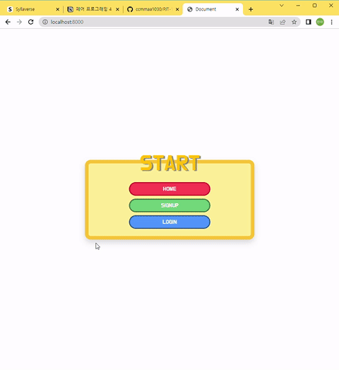

# Django 프로젝트11




### 1. 깃 저장소 생성

> branch master

#### 1-1. 깃 저장소 생성

- 원격 저장소 생성
- 로컬 저장소 깃 초기화

```bash
$ git init
```

#### 1-2. .gitignore

> https://www.toptal.com/developers/gitignore/

```bash
$ touch .gitignore
```

#### 1-3. commit & push

- commit : `init`
- push : `master`


### 2. 개발환경 설정

#### 2-0. 브랜치 생성 및 변경

> branch setup-env

```bash
$ git checkout -b setup-env
```

#### 2-1. 가상환경 생성 및 실행

> 가상환경 : 프로젝트별 별도 패키지 관리

```bash
# 가상환경 생성
$ python -m venv venv

# 가상환경 폴더 생성 확인
$ ls

# 가상환경 실행
$ source venv/Scripts/activate
(venv)
```

#### 2-2. Django, 추가 패키지 설치 및 기록

> 가상환경 실행한 상태에서 패키지지 설치

```bash
# Django LTS 버전 설치
$ pip install django==3.2.13

# Django-Bootstrap5 설치
$ pip install django-bootstrap5

# Django-Extensions 설치
$ pip install django-extensions

# Pillow 설치
$ pip install Pillow

# PILkit(Pillow 헬퍼) 설치
$ pip install pilkit

# django-imagekit(썸네일 헬퍼 장고 앱) 설치
$ pip install django-imagekit

# 패키지 설치 확인
$ pip list

# 패키지 기록
$ pip freeze > requirements.txt
```

#### 2-3. Django 프로젝트 생성

```bash
# Django 프로젝트 생성
$ django-admin startproject config .

# 프로젝트 폴더 생성 확인
$ ls
```

#### 2-4. 패키지 등록

- `config/settings.py` 파일의 `INSTALLED_APPS`에 추가

```python
INSTALLED_APPS = [
    'django_bootstrap5',
    'django_extensions',
    'imagekit'
    ...
]
```

#### 2-5. 브랜치 병합

```bash
$ git add .
$ git commit -m 'setup'
$ git push origin setup-env
```


### 3. Template 및 Static Files 관리

#### 3-0. 브랜치 생성 및 변경

> branch base

```bash
$ git checkout master
$ git pull origin master
$ git checkout -b base
```

#### 3-1 Templates 설정

- `config/templates` 폴더 생성 후, 템플릿 관리
- `config/settings.py` 파일의 `TEMLATES`의 `DIRS` 추가

```python
TEMPLATES = [
    {
        ...
        'DIRS': [BASE_DIR / 'config' / 'templates'],
        ...
    },
]
```

#### 3-2. STATIC files 설정

- `django.contrib.staticfiles`가 `config/settings.py` 파일의 `INSTALLED_APPS`에 포함되어 있는지 확인

```python
INSTALLED_APPS = [
    ...
    'django.contrib.staticfiles',
]
```

- `config/settings.py` 파일의 `INSTALLED_APPS`에 `STATIC_URL` 설정

```python
STATIC_URL = '/static/'
```

- `config/static/` 폴더 생성 후, 정적 파일 폴더별 관리
- 기본 경로를 제외하고 추가적인 정적 파일 경로 목록 정의 : `STATICFILES_DIRS`

```python
import os

...

STATIC_URL = '/static/'
STATICFILES_DIRS = [os.path.join(BASE_DIR, "config", "static")]
```

- `static/css` 폴더 생성 후, css 파일 관리

#### 3-3. 기본 Templates 관리

- `templates/base.html` 파일 생성

```bash



<!DOCTYPE html>
<html lang="en">

  <head>
    <meta charset="UTF-8">
    <meta http-equiv="X-UA-Compatible" content="IE=edge">
    <meta name="viewport" content="width=device-width, initial-scale=1.0">
    
    
    
    <link rel="stylesheet" href="https://cdn.jsdelivr.net/npm/bootstrap-icons@1.9.1/font/bootstrap-icons.css">
    <link rel="stylesheet" href="">
    <title>Document</title>
  </head>

  <body>
    
  </body>

</html>
```

#### 3-4. 브랜치 병합

```bash
$ git add .
$ git commit -m 'base'
$ git push origin base
```


### 4. 시작 페이지

#### 4-0. 브랜치 생성 및 변경

> branch gate

```bash
$ git checkout master
$ git pull origin master
$ git checkout -b gate
```

#### 4-1. URL 설정

- `config/urls.py` 파일에 추가

```python
from django.contrib import admin
from django.urls import path
from . import views

urlpatterns = [
    path('admin/', admin.site.urls),
    path('', views.index, name='index'),
]
```

#### 4-2. View 설정

- `config/views.py` 파일 생성

```python
from django.shortcuts import render

def index(request):

    return render(request, 'index.html')
```

#### 4-3. html 작성

- `config/templates/index.html` 파일 생성

```html




  <div class="box yellow shadow rounded-4 w-50 position-relative">
    <div class="position-absolute top-0 start-50 translate-middle">
      <h1 class="display-2 text-warning txt-shadow">START</h1>
    </div>
    <div class="box w-50 pt-5 pb-3">
      <a class="red click rounded-pill w-100 my-1" href="">HOME</a>
      <a class="green click rounded-pill w-100 my-1" href="">SIGNUP</a>
      <a class="blue click rounded-pill w-100 my-1" href="">LOGIN</a>
    </div>
  </div>

```

#### 4-4. 브랜치 병합

```bash
$ git add .
$ git commit -m 'gate'
$ git push origin gate
```


### 5. accounts App

#### 5-0. 브랜치 생성 및 변경

> branch accounts

```bash
$ git checkout master
$ git pull origin master
$ git checkout -b accounts
```

#### 5-1. App 생성

```bash
# Django 앱 생성
python manage.py startapp accounts
```

#### 5-2. App 등록

- `config/settings.py` 파일의 `INSTALLED_APPS`에 추가

```python
INSTALLED_APPS = [
    'accounts',
    ...
]
```

#### 5-3. URL 설정

> app 단위의 URL 관리

- `config/urls.py` 파일에 추가

```python
from django.contrib import admin
from django.urls import path, include
from . import views

urlpatterns = [
    path('admin/', admin.site.urls),
    path('', views.index, name='index'),
    path('accounts/', include('accounts.urls')),
]
```

- `accounts/urls.py` 파일 생성

```python
from django.urls import path
from . import views

app_name = 'accounts'

urlpatterns = [

]
```

#### 5-4. Templates 관리

- `accounts/templates/accounts` 폴더 생성 후, 템플릿 관리

#### 5-5. 브랜치 병합

```bash
$ git add .
$ git commit -m 'accounts'
$ git push origin accounts
```


### 6. User Model 정의

> Django AbstractUser 모델 상속

#### 6-0. 브랜치 생성 및 변경

> branch user-model

```bash
$ git checkout master
$ git pull origin master
$ git checkout -b user-model
```

#### 6-1. 클래스 정의

- `accounts/models.py` 파일에 클래스 추가

```python
from django.db import models
from django.contrib.auth.models import AbstractUser

class User(AbstractUser):
    pass
```

#### 6-2. User Model 등록

- `config/settings.py` 파일에  `AUTH_USER_MODEL` 추가

```python
# User Model
AUTH_USER_MODEL = 'accounts.User'
```

#### 6-3. 마이그레이션 파일 생성

- `accounts/migrations` 폴더에 생성된 파일 확인

```bash
$ python manage.py makemigrations
```

#### 6-4. DB 반영

```bash
$ python manage.py migrate
```

#### 6-5. 브랜치 병합

```bash
$ git add .
$ git commit -m 'user-model'
$ git push origin user-model
```


### 7. 회원 CRUD 기능 구현

#### 7-1. 회원가입 기능

##### (0) 브랜치 생성 및 변경

> branch accounts-signup

```bash
$ git checkout master
$ git pull origin master
$ git checkout -b accounts-signup
```

##### (1) CustomUserCreationForm 생성

- `accounts/forms.py` 파일 생성

```python
from django.contrib.auth.forms import UserCreationForm
from django.contrib.auth import get_user_model

class CustomUserCreationForm(UserCreationForm):
    class Meta:
        model = get_user_model()
        fields = ('username', 'password1', 'password2', 'email', 'first_name', 'last_name',)
```

##### (2) URL 설정

- `accounts/urls.py` 파일에 URL 설정

```python
from django.urls import path
from . import views

app_name = 'accounts'

urlpatterns = [
    path('signup/',  views.signup, name='signup'),
]
```

##### (3) View 설정

- `accounts/views.py` 파일에 임포트 추가 및 함수 생성

```python
from django.shortcuts import render, redirect
from .forms import CustomUserCreationForm

def signup(request):
    if request.method == 'POST':
        form = CustomUserCreationForm(request.POST)
        if form.is_valid():
            form.save()
            return redirect('index')
    else:
        form = CustomUserCreationForm()
    context = {
        'form':form
    }
    return render(request, 'accounts/signup.html', context)
```

##### (4) html 작성

- `accounts/signup.html` 파일 생성

```html




  <div class="box yellow shadow rounded-4 w-50 position-relative">
    <div class="position-absolute top-0 start-50 translate-middle">
      <h1 class="display-2 text-warning txt-shadow">SIGNUP</h1>
    </div>
    <div class="box w-100 pt-5 pb-3 px-3">
      <form action="" method="POST">
        
        
        <div class="left">
          <input class="green click rounded-pill my-1 px-3" type="submit" value="OK">
        </div>
      </form>
    </div>
  </div>

```

##### (4)  페이지 연결

- `config/templates/index.html` 파일에 추가

```html
<a class="green click rounded-pill w-100 my-1" href="">SIGNUP</a>
```

##### (5) 브랜치 병합

```bash
$ git add .
$ git commit -m 'accounts-signup'
$ git push origin accounts-signup
```

#### 7-2. 로그인 기능

##### (0) 브랜치 생성 및 변경

> branch accounts-login

```bash
$ git checkout master
$ git pull origin master
$ git checkout -b accounts-login
```

##### (1) URL 설정

- `accounts/urls.py` 파일에 URL 설정

```python
from django.urls import path
from . import views

app_name = 'accounts'

urlpatterns = [
    path('signup/',  views.signup, name='signup'),
    path('login/', views.login, name='login'),
]
```

##### (2) View 설정

- `accounts/views.py` 파일에 임포트 추가 및 함수 생성

```python
...
from django.contrib.auth.forms import AuthenticationForm
from django.contrib.auth import login as auth_login

...

def login(request):
    if request.method == 'POST':
        form = AuthenticationForm(request, data=request.POST)
        if form.is_valid():
            auth_login(request, form.get_user())
            return redirect('index')
    else:
        form = AuthenticationForm()
    context = {
        'form': form
    }
    return render(request, 'accounts/login.html', context)
```

##### (3) html 작성

- `accounts/login.html` 파일 생성

```html




  <div class="box yellow shadow rounded-4 w-50 position-relative">
    <div class="position-absolute top-0 start-50 translate-middle">
      <h1 class="display-2 text-warning txt-shadow">LOGIN</h1>
    </div>
    <div class="box w-100 pt-5 pb-3 px-3">
      <form action="" method="POST">
        
        
        <div class="left">
          <input class="blue click rounded-pill my-1 px-3" type="submit" value="OK">
        </div>
      </form>
    </div>
  </div>

```

##### (4)  페이지 연결

- `config/templates/index.html` 파일에 추가

```html
<a class="blue click rounded-pill w-100 my-1" href="">LOGIN</a>
```

##### (5) 브랜치 병합

```bash
$ git add .
$ git commit -m 'accounts-login'
$ git push origin accounts-login
```

#### 7-3. 회원 상세정보 기능

##### (0) 브랜치 생성 및 변경

> branch accounts-detail

```bash
$ git checkout master
$ git pull origin master
$ git checkout -b accounts-detail
```

##### (1) URL 설정

- `accounts/urls.py` 파일에 URL 설정

```python
from django.urls import path
from . import views

app_name = 'accounts'

urlpatterns = [
    path('signup/', views.signup, name='signup'),
    path('login/', views.login, name='login'),
    path('<int:user_pk>/', views.detail, name='detail'),
]
```

##### (2) View 설정

- `accounts/views.py` 파일에 임포트 추가 및 함수 생성

```python
...
from django.contrib.auth import get_user_model

...

def detail(request, user_pk):
    user = get_user_model().objects.get(pk=user_pk)
    context = {
        'user': user
    }
    return render(request, 'accounts/detail.html', context)
```

##### (3) html 작성

- `accounts/detail.html` 파일 생성

```html




  <div class="box w-100">
    <div class="box yellow shadow rounded-4 w-75 position-relative">
      <div class="position-absolute top-0 start-50 translate-middle">
        <h1 class="display-2 text-warning txt-shadow">{{ user }}'S INFO</h1>
      </div>
      <div class="box w-100 pt-5 pb-3 px-3">
        <dl class="row">
          <dt class="col-sm-3 text-center">username</dt>
          <dd class="col-sm-9">{{ user.username }}</dd>
          <dt class="col-sm-3 text-center">date_joined</dt>
          <dd class="col-sm-9">{{ user.date_joined }}</dd>
          <dt class="col-sm-3 text-center">email</dt>
          <dd class="col-sm-9">{{ user.email }}</dd>
          <dt class="col-sm-3 text-center">last_name</dt>
          <dd class="col-sm-9">{{ user.last_name }}</dd>
          <dt class="col-sm-3 text-center">first_name</dt>
          <dd class="col-sm-9">{{ user.first_name }}</dd>
        </dl>
      </div>
      <div class="w-100 left px-3">
        
          <a class="red click rounded-pill m-1 px-3" href="">LOGOUT</a>
        
          <a class="green click rounded-pill m-1 px-3" href="">LOGIN</a>
        
        <a class="blue click rounded-pill m-1 px-3" href="">HOME</a>
      </div>
    </div>
  </div>

```

##### (5) 브랜치 병합

```bash
$ git add .
$ git commit -m 'accounts-detail'
$ git push origin accounts-detail
```

#### 7-4. 로그아웃 기능

##### (0) 브랜치 생성 및 변경

> branch accounts-logout

```bash
$ git checkout master
$ git pull origin master
$ git checkout -b accounts-logout
```

##### (1) URL 설정

- `accounts/urls.py` 파일에 URL 설정

```python
from django.urls import path
from . import views

app_name = 'accounts'

urlpatterns = [
    path('signup/', views.signup, name='signup'),
    path('login/', views.login, name='login'),
    path('<int:user_pk>/', views.detail, name='detail'),
    path('logout/', views.logout, name='logout'),
]
```

##### (2) View 설정

- `accounts/views.py` 파일에 임포트 추가 및 함수 생성

```python
...
from django.contrib.auth.decorators import login_required
from django.contrib.auth import logout as auth_logout

...

@login_required
def logout(request):
    auth_logout(request)
    return redirect('accounts:login')
```

##### (3)  페이지 연결

- `accounts/detail.html` 파일에 추가

```html
<a class="red click rounded-pill m-1 px-3" href="">LOGOUT</a>
```

##### (4) 브랜치 병합

```bash
$ git add .
$ git commit -m 'accounts-logout'
$ git push origin accounts-logout
```


### 8. reviews App

#### 8-0. 브랜치 생성 및 변경

> branch reviews

```bash
$ git checkout master
$ git pull origin master
$ git checkout -b reviews
```

#### 8-1. App 생성

```bash
# Django 앱 생성
python manage.py startapp reviews
```

#### 8-2. App 등록

- `config/settings.py` 파일의 `INSTALLED_APPS`에 추가

```python
INSTALLED_APPS = [
    'reviews',
    ...
]
```

#### 8-3. URL 설정

> app 단위의 URL 관리

- `config/urls.py` 파일에 추가

```python
from django.contrib import admin
from django.urls import path, include
from . import views

urlpatterns = [
    path('admin/', admin.site.urls),
    path('', views.index, name='index'),
    path('accounts/', include('accounts.urls')),
    path('reviews/', include('reviews.urls')),
]
```

- `reviews/urls.py` 파일 생성

```python
from django.urls import path
from . import views

app_name = 'reviews'

urlpatterns = [
    path('', views.index, name='index'),
]
```

#### 8-4. View 설정

- `reviews/views.py` 파일에 함수 생성

```python
from django.shortcuts import render

def index(request):

    return render(request, 'reviews/index.html')
```

#### 8-5. Templates 관리

- `reviews/templates/reviews` 폴더 생성 후, 템플릿 관리
- `reviews/index.html` 파일 생성

#### 8-6. 브랜치 병합

```bash
$ git add .
$ git commit -m 'reviews'
$ git push origin reviews
```


### 9. Review Model 정의

#### 9-0. 브랜치 생성 및 변경

> branch review-model

```bash
$ git checkout master
$ git pull origin master
$ git checkout -b review-model
```

#### 9-1. 클래스 정의

- `reviews/models.py` 파일에 클래스 추가

```python
from django.db import models
from django.conf import settings

class Review(models.Model):
    title = models.CharField(max_length=80)
    content = models.TextField()
    image = models.ImageField(upload_to='articles/', blank=True)
    movie_name = models.CharField(max_length=80)
    grade_choices = (
        (1, '★'),
        (2, '★★'),
        (3, '★★★'),
        (4, '★★★★'),
        (5, '★★★★★'),
    )
    grade = models.IntegerField(choices=grade_choices)
    created_at = models.DateField(auto_now_add=True)
    updated_at = models.DateField(auto_now=True)
    user = models.ForeignKey(settings.AUTH_USER_MODEL, on_delete=models.CASCADE)
```

#### 9-2. 마이그레이션 파일 생성

- `reviews/migrations` 폴더에 생성된 파일 확인

```bash
$ python manage.py makemigrations
```

#### 9-3. DB 반영

```bash
$ python manage.py migrate
```

#### 9-4. 브랜치 병합

```bash
$ git add .
$ git commit -m 'review-model'
$ git push origin review-model
```


### 10. 리뷰 CRUD 기능 구현

#### 10-1. 리뷰 작성 기능

##### (0) 브랜치 생성 및 변경

> branch reviews-create

```bash
$ git checkout master
$ git pull origin master
$ git checkout -b reviews-create
```

##### (1) ModelForm 선언

- `reviews/forms.py` 파일 생성

```python
from django import forms
from .models import Review

class ReviewForm(forms.ModelForm):
    class Meta:
        model = Review
        fields = ['title', 'movie_name', 'grade', 'content', 'image']
```

##### (2) Media 설정

- `config/settings.py` 파일에 `MEDIA_ROOT`, `MEDIA_URL` 설정

```python
MEDIA_ROOT = BASE_DIR / 'reviews'
MEDIA_URL = '/media/'
```

- `config/urls.py` 파일에 업로드 한 미디어 파일 제공

```python
...
from django.conf import settings
from django.conf.urls.static import static

urlpatterns = [
    ...
] + static(settings.MEDIA_URL, document_root=settings.MEDIA_ROOT)
```

##### (3) URL 설정

- `reviews/urls.py` 파일에 URL 설정

```python
from django.urls import path
from . import views

app_name = 'reviews'

urlpatterns = [
    path('', views.index, name='index'),
    path('create/', views.create, name='create'),
]
```

##### (4) View 설정

- `reviews/views.py` 파일에 임포트 추가 및 함수 생성

```python
from django.shortcuts import render, redirect
from django.contrib.auth.decorators import login_required
from .forms import ReviewForm

...

@login_required
def create(request):
    if request.method == 'POST':
        review_form = ReviewForm(request.POST, request.FILES)
        if review_form.is_valid():
            review = review_form.save(commit=False)
            review.user = request.user
            review.save()
            return redirect('reviews:index')
    else:
        review_form = ReviewForm()
    context = {
        'review_form': review_form
    }
    return render(request, 'reviews/form.html', context=context)
```

##### (5) html 작성

- `reviews/form.html` 파일 생성

```html




  <div class="box yellow shadow rounded-4 w-50 position-relative">
    <div class="w-100 position-absolute top-0 start-50 translate-middle">
      <h1 class="display-2 text-warning txt-shadow text-center">
        
          NEW REVIEW
        
          EDIT REVIEW
        
      </h1>
    </div>
    <div class="box w-100 pt-5 pb-3 px-3">
      <form action="" method="POST" enctype="multipart/form-data">
        
        
        <div class="left">
          <input class="green click rounded-pill my-1 px-3" type="submit" value="OK">
        </div>
      </form>
    </div>
  </div>

```

##### (6) 브랜치 병합

```bash
$ git add .
$ git commit -m 'reviews-create'
$ git push origin reviews-create
```

#### 10-2. 게시글 목록 기능

##### (0) 브랜치 생성 및 변경

> branch reviews-index

```bash
$ git checkout master
$ git pull origin master
$ git checkout -b reviews-index
```

##### (1) View 설정

- `reviews/views.py` 파일에 임포트 추가 및 함수 수정

```python
...
from .models import Review

def index(request):
    reviews = Review.objects.order_by('-pk')
    context = {
        'reviews': reviews
    }
    return render(request, 'reviews/index.html', context)
```

##### (2) html 작성

- `reviews/index.html` 파일 수정

```html




  <div class="box w-100 m-3 p-5">
    <h1 class="display-2 text-warning txt-shadow">REVIEWS</h1>
    <div class="w-100 left px-3">
      
        <a class="red click rounded-pill m-1 px-3" href="">LOGOUT</a>
        <a class="green click rounded-pill m-1 px-3" href="">NEW REVIEW</a>
      
        <a class="green click rounded-pill my-1 px-3" href="">SIGNUP</a>
        <a class="blue click rounded-pill my-1 px-3" href="">LOGIN</a>
      
    </div>
    <div class="row w-100">
      
        <div class="col-4">
          <div class="box yellow shadow rounded-4 position-relative">
            <div class="position-absolute top-0 start-50 translate-middle">
              <h1 class="display-4 text-warning txt-shadow">NO.{{ review.pk }}</h1>
            </div>
            <div class="box w-100 pt-4 pb-3 px-3">
              
              <a class="text-dark fs-4 fw-bold mx-0" href="">{{ review.title }}</a>
              <p class="m-0 w-100 text-center">
                {{ review.movie_name }}
                |
                {{ review.get_grade_display }}
              </p>
              <p class="m-0 w-100 text-end">
                <a href="">
                  {{ review.user.username }}
                </a>
                |
                {{ review.created_at | date:"Y-m-d" }}
              </p>
            </div>
          </div>
        </div>
      
    </div>
  </div>

```

##### (3) 페이지 연결

- `config/templates/index.html` 파일에 추가

```html
<a class="red click rounded-pill w-100 my-1" href="">HOME</a>
```

- `accounts/detail.html` 파일에 추가

```html
<a class="blue click rounded-pill m-1 px-3" href="">HOME</a>
```

##### (4) 브랜치 병합

```bash
$ git add .
$ git commit -m 'reviews-index'
$ git push origin reviews-index
```

#### 10-3. 게시글 상세보기 기능

##### (0) 브랜치 생성 및 변경

> branch reviews-detail

```bash
$ git checkout master
$ git pull origin master
$ git checkout -b reviews-detail
```

##### (1) URL 설정

- `reviews/urls.py` 파일에 URL 설정

```python
from django.urls import path
from . import views

app_name = 'reviews'

urlpatterns = [
    path('', views.index, name='index'),
    path('create/', views.create, name='create'),
    path('<int:review_pk>/', views.detail, name='detail'),
]
```

##### (2) View 설정

- `reviews/views.py` 파일에 함수 생성

```python
...

def detail(request, review_pk):
    review = Review.objects.get(pk=review_pk)
    context = {
        'review': review
    }
    return render(request, 'reviews/detail.html', context)
```

##### (3) html 작성

- `reviews/detail.html` 파일 생성

```html




  <div class="box w-100">
    <div class="box yellow shadow rounded-4 w-75 position-relative">
      <div class="position-absolute top-0 start-50 translate-middle">
        <h1 class="display-2 text-warning txt-shadow">NO.{{ review.pk }}</h1>
      </div>
      <div class="box w-100 pt-5 pb-3 px-3">
        <div class="row">
          <div class="col-5">
            
          </div>
          <div class="col-7 d-flex align-items-center">
            <dl class="row">
              <dt class=" col-sm-3 text-center">title</dt>
              <dd class="col-sm-9">{{ review.title }}</dd>
              <dt class=" col-sm-3 text-center">movie_name</dt>
              <dd class="col-sm-9">{{ review.movie_name }}</dd>
              <dt class=" col-sm-3 text-center">grade</dt>
              <dd class="col-sm-9">
                {{ review.get_grade_display }}
                {{ review.grade }}
              </dd>
              <dt class="col-sm-3 text-center">content</dt>
              <dd class="col-sm-9">{{ review.content }}</dd>
              <dt class=" col-sm-3 text-center">username</dt>
              <dd class="col-sm-9">
                <a class="text-black" href="">
                  {{ review.user.username }}
                </a>
              </dd>
              <dt class="col-sm-3 text-center">created_at</dt>
              <dd class="col-sm-9">{{ review.created_at | date:"Y-m-d" }}</dd>
              <dt class="col-sm-3 text-center">updated_at</dt>
              <dd class="col-sm-9">{{ review.updated_at | date:"Y-m-d" }}</dd>
            </dl>
          </div>
        </div>
      </div>
      <div class="w-100 left px-3">
        
          
            <a class="blue click rounded-pill m-1 px-3" href="">UPDATE</a>
            <a class="red click rounded-pill m-1 px-3" href="">DELETE</a>
          
        
      </div>
    </div>
  </div>

```

##### (4) 페이지 연결

- `reviews/index.html` 파일에 추가

```html
<a class="text-dark fs-4 fw-bold mx-0" href="">{{ review.title }}</a>
```

##### (5) 브랜치 병합

```bash
$ git add .
$ git commit -m 'reviews-detail'
$ git push origin reviews-detail
```

#### 10-4. 게시글 수정 기능

##### (0) 브랜치 생성 및 변경

> branch reviews-update

```bash
$ git checkout master
$ git pull origin master
$ git checkout -b reviews-update
```

##### (1) URL 설정

- `reviews/urls.py` 파일에 URL 설정

```python
from django.urls import path
from . import views

app_name = 'reviews'

urlpatterns = [
    path('', views.index, name='index'),
    path('create/', views.create, name='create'),
    path('<int:review_pk>/', views.detail, name='detail'),
    path('<int:review_pk>/update/', views.update, name='update'),
]
```

##### (2) View 설정

- `reviews/views.py` 파일에 함수 생성

```python
...
from django.contrib import messages

@login_required
def update(request, review_pk):
    review = Review.objects.get(pk=review_pk)
    if request.user == review.user: 
        if request.method == 'POST':
            review_form = ReviewForm(request.POST, request.FILES, instance=review)
            if review_form.is_valid():
                review_form.save()
                return redirect('reviews:detail', review.pk)
        else:
            review_form = ReviewForm(instance=review)
        context = {
            'review_form': review_form
        }
        return render(request, 'reviews/form.html', context)
    else:
        messages.warning(request, '작성자만 수정할 수 있습니다.')
        return redirect('reviews:detail', review.pk)
```

##### (3) 페이지 연결

- `reviews/detail.html` 파일에 추가

```html
<a class="blue click rounded-pill m-1 px-3" href="">UPDATE</a>
```

##### (4) 브랜치 병합

```bash
$ git add .
$ git commit -m 'reviews-update'
$ git push origin reviews-update
```

#### 10-5. 게시글 삭제 기능

##### (0) 브랜치 생성 및 변경

> branch reviews-delete

```bash
$ git checkout master
$ git pull origin master
$ git checkout -b reviews-delete
```

##### (1) URL 설정

- `reviews/urls.py` 파일에 URL 설정

```python
from django.urls import path
from . import views

app_name = 'reviews'

urlpatterns = [
    path('', views.index, name='index'),
    path('create/', views.create, name='create'),
    path('<int:review_pk>/', views.detail, name='detail'),
    path('<int:review_pk>/update/', views.update, name='update'),
    path('<int:review_pk>/delete/', views.delete, name='delete'),
]
```

##### (2) View 설정

- `reviews/views.py` 파일에 함수 생성

```python
...

@login_required
def delete(request, review_pk):
    review = Review.objects.get(pk=review_pk)
    review.delete()
    return redirect('reviews:index')
```

##### (3) 페이지 연결

- `reviews/detail.html` 파일에 추가

```html
<a class="red click rounded-pill m-1 px-3" href="">DELETE</a>
```

##### (4) 브랜치 병합

```bash
$ git add .
$ git commit -m 'reviews-delete'
$ git push origin reviews-delete
```

#### 10-6. 회원 게시글 목록 기능

##### (0) 브랜치 생성 및 변경

> branch user-review

```bash
$ git checkout master
$ git pull origin master
$ git checkout -b user-review
```

##### (1) html 작성

- `accounts/detail.html` 파일에 추가

```html
<hr>
<div class="row w-75">
  <div class="col-6">
    <p class="text-muted text-center">
      {{ user.review_set.count }}
      REVIEWS
    </p>
    
      <div class="yellow shadow rounded-4 w-100 my-1">
        <div class="row p-1 w-100">
          <div class="col-2 py-1">
            <p class="my-1 mx-3">{{ review.pk }}</p>
          </div>
          <div class="col-10 py-2">
            <a class="text-dark my-1" href="">{{ review.title }}</a>
          </div>
        </div>
      </div>
    
  </div>
</div>
```

##### (2) 브랜치 병합

```bash
$ git add .
$ git commit -m 'user-review'
$ git push origin user-review
```


### 11. Comment Model 정의 

#### 11-0. 브랜치 생성 및 변경

> branch comment-model

```bash
$ git checkout master
$ git pull origin master
$ git checkout -b comment-model
```

#### 11-1. 클래스 정의

- `reviews/models.py` 파일에 클래스 추가

```python
...

class Comment(models.Model):
    content = models.TextField(max_length=80)
    created_at = models.DateTimeField(auto_now_add=True)
    review = models.ForeignKey(Review, on_delete=models.CASCADE)
    user = models.ForeignKey(settings.AUTH_USER_MODEL, on_delete=models.CASCADE)
```

#### 11-2. 마이그레이션 파일 생성

- `reviews/migrations` 폴더에 생성된 파일 확인

```bash
$ python manage.py makemigrations
```

#### 11-3. DB 반영

```bash
$ python manage.py migrate
```

#### 11-4. 브랜치 병합

```bash
$ git add .
$ git commit -m 'comment-model'
$ git push origin comment-model
```


### 12. 댓글 CRUD 기능 구현

#### 12-1. 댓글 작성 기능

##### (0) 브랜치 생성 및 변경

> branch comments-create

```bash
$ git checkout master
$ git pull origin master
$ git checkout -b comments-create
```

##### (1) ModelForm 선언

- `reviews/forms.py` 파일에 추가

```python
from django import forms
from .models import Review, Comment

...

class CommentForm(forms.ModelForm):
    class Meta:
        model = Comment
        fields = ['content',]
        widgets = {
            'content': forms.Textarea(attrs={'rows': 2})
        }
```

##### (2) URL 설정

- `reviews/urls.py` 파일에 URL 설정

```python
from django.urls import path
from . import views

app_name = 'reviews'

urlpatterns = [
    path('', views.index, name='index'),
    path('create/', views.create, name='create'),
    path('<int:review_pk>/', views.detail, name='detail'),
    path('<int:review_pk>/update/', views.update, name='update'),
    path('<int:review_pk>/delete/', views.delete, name='delete'),
    path('<int:review_pk>/comments/', views.comment_create, name='comment_create'),
]
```

##### (3) View 설정

- `reviews/views.py` 파일에 함수 수정

```python
...
from .forms import ReviewForm, CommentForm

...

def detail(request, review_pk):
    review = Review.objects.get(pk=review_pk)
    comment_form = CommentForm()
    context = {
        'review': review,
        'comment_form': comment_form
    }
    return render(request, 'reviews/detail.html', context)
```

- `reviews/views.py` 파일에 함수 생성

```python
...

@login_required
def comment_create(request, review_pk):
    review = Review.objects.get(pk=review_pk)
    comment_form = CommentForm(request.POST)
    if comment_form.is_valid():
        comment = comment_form.save(commit=False)
        comment.review = review
        comment.user = request.user
        comment.save()
    return redirect('reviews:detail', review.pk)
```

##### (4) html 작성

- `reviews/detail.html` 파일 생성

```html
<hr>
<form class="w-75" action="" method="POST">
  
  
  <div class="left">
    <input class="green click rounded-pill my-1 px-3" type="submit" value="OK">
  </div>
</form>
```

##### (5) 브랜치 병합

```bash
$ git add .
$ git commit -m 'comments-create'
$ git push origin comments-create
```

#### 12-2. 댓글 목록 기능

##### (0) 브랜치 생성 및 변경

> branch comments-index

```bash
$ git checkout master
$ git pull origin master
$ git checkout -b comments-index
```

##### (1) View 설정

- `reviews/views.py` 파일에 임포트 추가 및 함수 수정

```python
...

def detail(request, review_pk):
    review = Review.objects.get(pk=review_pk)
    comment_form = CommentForm()
    comments = review.comment_set.all()
    context = {
        'review': review,
        'comment_form': comment_form,
        'comments': comments
    }
    return render(request, 'reviews/detail.html', context)
```

##### (2) html 작성

- `reviews/detail.html` 파일 수정

```html
<hr>

  <p class="text-muted text-center">
    {{ comments|length }}
    COMMENTS
  </p>
  <div class="yellow shadow rounded-4 w-75 my-1">
    <div class="row p-1 w-100">
      <div class="col-2 py-2">
        <p class="my-1 mx-3">{{ comment.user.username }}</p>
      </div>
      <div class="col-9 py-2">
        <p class="my-1 mx-3">{{ comment.content }}</p>
      </div>
      <div class="col-1 py-1 left">
        <a class="red click rounded-pill px-3" href="">DELETE</a>
      </div>
    </div>
  </div>
  
  <p class="text-muted text-center">0 COMMENTS</p>

```

##### (3) 브랜치 병합

```bash
$ git add .
$ git commit -m 'comments-index'
$ git push origin comments-index
```

#### 12-3. 댓글 삭제 기능

##### (0) 브랜치 생성 및 변경

> branch comments-delete

```bash
$ git checkout master
$ git pull origin master
$ git checkout -b comments-delete
```

##### (1) URL 설정

- `reviews/urls.py` 파일에 URL 설정

```python
from django.urls import path
from . import views

app_name = 'reviews'

urlpatterns = [
    path('', views.index, name='index'),
    path('create/', views.create, name='create'),
    path('<int:review_pk>/', views.detail, name='detail'),
    path('<int:review_pk>/update/', views.update, name='update'),
    path('<int:review_pk>/delete/', views.delete, name='delete'),
    path('<int:review_pk>/comments/', views.comment_create, name='comment_create'),
    path('<int:review_pk>/comments/<int:comment_pk>/delete/', views.comment_delete, name='comment_delete'),
]
```

##### (2) View 설정

- `reviews/views.py` 파일에 함수 생성

```python
...
from .models import Review, Comment

...

@login_required
def comment_delete(request, review_pk, comment_pk):
    comment = Comment.objects.get(pk=comment_pk)
    comment.delete()
    return redirect('articles:detail', review_pk)
```

##### (3) 페이지 연결

- `reviews/detail.html` 파일에 추가

```html

    
        <div class="col-1 py-1 left">
            <a class="red click rounded-pill px-3" href="">DELETE</a>
        </div>
    

```

##### (4) 브랜치 병합

```bash
$ git add .
$ git commit -m 'comments-delete'
$ git push origin comments-delete
```

#### 12-4. 회원 댓글 목록 기능

##### (0) 브랜치 생성 및 변경

> branch user-comment

```bash
$ git checkout master
$ git pull origin master
$ git checkout -b user-comment
```

##### (1) html 작성

- `accounts/detail.html` 파일에 추가

```html
<hr>
<div class="row w-75">
  <div class="col-6">
    <p class="text-muted text-center">
      {{ user.comment_set.count }}
      COMMENTS
    </p>
    
      <div class="yellow shadow rounded-4 w-100 my-1">
        <div class="row p-1 w-100">
          <div class="col-2 py-1">
            <p class="my-1 mx-3">{{ forloop.counter }}</p>
          </div>
          <div class="col-10 py-2">
            <a class="text-dark my-1" href="">{{ comment.content }}</a>
          </div>
        </div>
      </div>
    
  </div>
</div>
```

##### (2) 브랜치 병합

```bash
$ git add .
$ git commit -m 'user-comment'
$ git push origin user-comment
```

